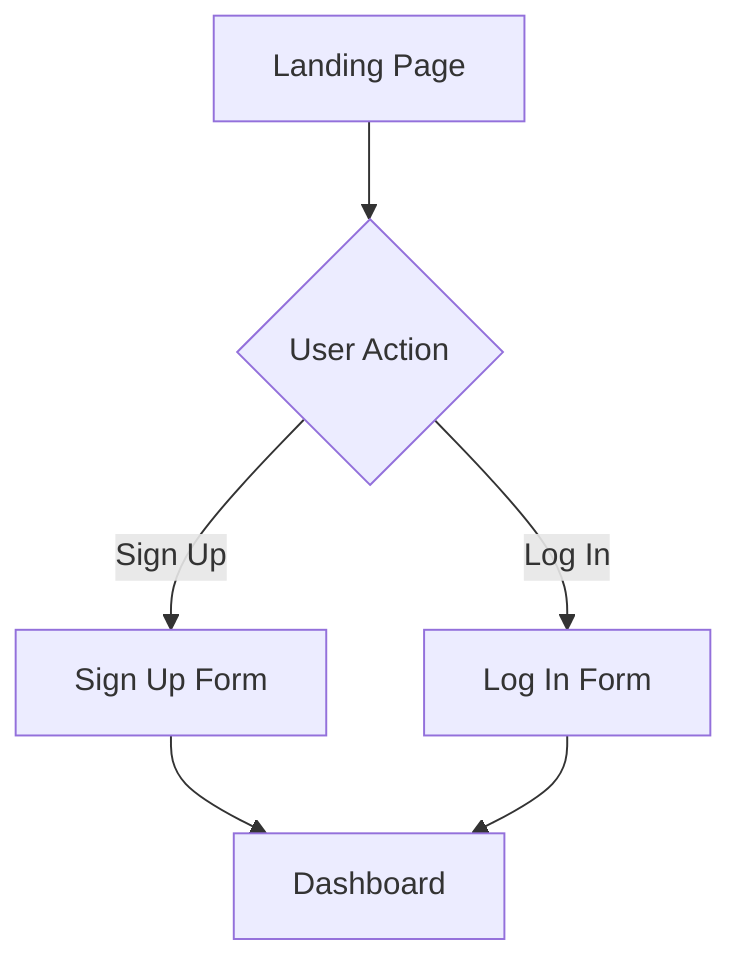

# User Flow Documentation

## Overview

This document defines the user flows for the app, including onboarding, core user journey, error handling, edge cases, and alternative flows. The flows are represented using Mermaid diagrams for easy visualization.

---

## Onboarding Flow

### Steps:

1. **Landing Page:**
   - User arrives at the app’s landing page.
   - Options: "Log In" or "Sign Up."
2. **Sign Up:**
   - User clicks "Sign Up."
   - Options: Email/password or social login (e.g., Google).
   - User enters required details and creates an account.
3. **Log In:**
   - User clicks "Log In."
   - Options: Email/password or social login.
   - User enters credentials and logs in.
4. **Dashboard:**
   - User is redirected to the dashboard after successful login/sign-up.

### Mermaid Diagram:

Core User Journey
Steps:
Dashboard:

User lands on the dashboard after logging in.

Options: "Search Videos," "Trending Videos," "Chat."

Search Videos:

User enters a keyword and clicks "Search."

App displays a list of related videos.

Analyze Videos:

User selects a video for analysis.

App analyzes the video transcript and generates ideas.

Refine Ideas:

User clicks "Chat" to refine ideas.

User interacts with the LLM to customize ideas.

Save/Export Ideas:

User saves or exports the refined ideas in CSV format.

Mermaid Diagram:
graph TD
A[Dashboard] --> B{User Action}
B -->|Search Videos| C[Keyword Search]
C --> D[Display Videos]
D --> E{User Action}
E -->|Analyze Video| F[Generate Ideas]
F --> G{User Action}
G -->|Refine Ideas| H[Chat with LLM]
H --> I[Save/Export Ideas]
Error Handling
Scenarios:
Invalid Login:

User enters incorrect credentials.

App displays an error message: "Invalid email or password."

Failed API Call:

App fails to fetch data from the YouTube API.

App displays an error message: "Failed to fetch videos. Please try again."

Network Issues:

User loses internet connection.

App displays an error message: "Network error. Please check your connection."

Mermaid Diagram:
graph TD
A[User Action] --> B{Error?}
B -->|Yes| C[Display Error Message]
B -->|No| D[Continue Flow]
C --> E{User Action}
E -->|Retry| A
E -->|Cancel| F[Exit Flow]
Edge Cases
Scenarios:
Offline Mode:

User tries to use the app without an internet connection.

App displays a message: "You are offline. Please connect to the internet."

Incomplete Data:

App fails to fetch complete video data.

App displays a message: "Incomplete data. Please try again."

Expired Session:

User’s session expires while using the app.

App redirects the user to the login page.

Mermaid Diagram:
graph TD
A[User Action] --> B{Edge Case?}
B -->|Yes| C[Handle Edge Case]
B -->|No| D[Continue Flow]
C --> E{User Action}
E -->|Retry| A
E -->|Cancel| F[Exit Flow]
Alternative Flows
Scenarios:
Guest Mode:

User accesses the app without logging in.

App provides limited functionality (e.g., view trending videos).

Skip Onboarding:

User skips the onboarding process.

App redirects the user to the dashboard with default settings.

Mermaid Diagram:
graph TD
A[User Action] --> B{Alternative Flow?}
B -->|Yes| C[Handle Alternative Flow]
B -->|No| D[Continue Flow]
C --> E{User Action}
E -->|Continue| D
E -->|Cancel| F[Exit Flow]
User Permissions
Roles:
Regular User:

Can search videos, analyze transcripts, and refine ideas.

Admin:

Can manage users, view analytics, and configure app settings.

Mermaid Diagram:
mermaid
graph TD
A[User Role] --> B{Admin?}
B -->|Yes| C[Admin Dashboard]
B -->|No| D[Regular User Dashboard]
C --> E[Manage Users]
C --> F[View Analytics]
C --> G[Configure Settings]
D --> H[Search Videos]
D --> I[Analyze Transcripts]
D --> J[Refine Ideas]
Notifications
Triggers:
New Idea Generated:

App notifies the user when a new idea is generated.

Trending Videos Updated:

App notifies the user when trending videos are updated.

Mermaid Diagram:
graph TD
A[Trigger] --> B{Notification?}
B -->|Yes| C[Send Notification]
B -->|No| D[Continue Flow]
C --> E{User Action}
E -->|View| F[Display Notification]
E -->|Dismiss| G[Continue Flow]
